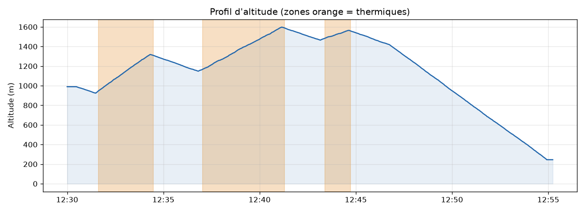

# 🪂 FlyLog


**Analyseur de traces de vol libre (parapente, delta) au format IGC.**

Tu donnes à FlyLog le fichier `.igc` de ton vario ou de ton application de vol. Il te sort les statistiques du vol, détecte automatiquement les thermiques et génère une carte interactive et un profil d'altitude.



## Fonctionnalités

- 📄 **Parser IGC** sans dépendance (en-têtes, points GPS, passage de minuit, hémisphères S/W)
- 📒 **Carnet de vol** synchronisé avec le dossier Syride (ou tout dossier d'IGC)
- 📊 **Statistiques** : durée, distance parcourue, altitudes, gain cumulé, vario max, taux de chute, vitesse sol
- 🌀 **Détection des thermiques** : gain, taux de montée moyen, durée, plafond
- 🖥️ **Interface web** sans serveur (Python dans le navigateur via Pyodide)
- 🗺️ **Carte interactive** (topo / satellite) avec la trace colorée selon le vario et les thermiques en surbrillance
- 📈 **Profil d'altitude** avec les phases de thermique mises en évidence

## Interface web

👉 **Démo en ligne : https://ElRelook.github.io/flylog/**

Glisse ton fichier `.igc` dans la page pour voir tes stats, la carte (topo ou satellite) avec la trace colorée selon le vario, la liste des thermiques et le profil d'altitude. Au survol du profil, ta position s'affiche sur la carte. Le seuil de détection des thermiques se règle en direct.

L'interface n'a **pas de backend** : le package Python `flylog` tourne directement dans le navigateur grâce à [Pyodide](https://pyodide.org). Ton fichier n'est envoyé nulle part, et les calculs sont les mêmes que ceux de la ligne de commande, couverts par les tests.

**Carnet de vol** : clique sur « Connecter mon dossier Syride » et choisis `Documents\Syride`, ou glisse ce dossier dans la page. Tu obtiens :

- tes totaux et tes records (heures, distance, plafond, meilleur thermique…) ;
- **toutes tes traces sur une seule carte**, avec tes sites de déco ;
- tes heures de vol par mois ;
- la liste de tes vols, triable. Un clic ouvre l'analyse détaillée du vol.

Le carnet reste enregistré dans ton navigateur (IndexedDB), et Chrome ou Edge se souviennent du dossier : ensuite, un clic sur **Synchroniser** suffit pour récupérer tes nouveaux vols.

Pour la lancer en local :

```bash
python -m http.server 8000
# puis ouvre http://localhost:8000
```

Mise en ligne : dans *Settings → Pages* du dépôt GitHub, choisis la source **GitHub Actions**. Le workflow `pages.yml` publie ensuite le site à chaque push.

## Installation

```bash
git clone https://github.com/ElRelook/flylog.git
cd flylog
pip install -e ".[plot]"
```

## Utilisation

```bash
flylog examples/vol_exemple.igc --map carte.html --profile profil.png
```

```
  Vol du 18/09/2026
  Pilote : Pilote Demo
  Voile  : Voile EN-B

  Durée                 0h25
  Distance parcourue    13.2 km
  Altitude max          1598 m
  Gain cumulé           935 m
  Vario max             +2.8 m/s
  ...

  3 thermique(s) détecté(s)
    #1  12:31  + 369 m   2.2 m/s   2.9 min  plafond 1318 m
    #2  12:37  + 431 m   1.7 m/s   4.3 min  plafond 1598 m
    #3  12:43  +  82 m   1.0 m/s   1.3 min  plafond 1565 m
```

### Carnet de vol (synchro Syride)

Syride (SYS-PC-Tool ou l'app) copie chaque vol synchronisé dans `Documents/Syride`. FlyLog s'appuie sur ce dossier pour tenir ton carnet :

```bash
flylog sync      # ajoute les nouveaux vols au carnet
flylog carnet    # totaux, records, heures par année, liste des vols
```

```
  Carnet de vol : 20 vols, 34h08 de vol depuis le 01/08/2025

  Distance totale     1 080 km
  Plafond record      3319 m (12/07/2026)
  Plus long vol       3h44 (22/05/2026)
  ...
```

- `--source DOSSIER` synchronise n'importe quel dossier de fichiers `.igc` (XCTrack, Flymaster…).
- Un même vol copié dans plusieurs dossiers n'est compté qu'une fois : les fichiers sont identifiés par leur contenu.
- Quand l'analyse évolue, la synchro suivante recalcule automatiquement tout le carnet.
- Le carnet est enregistré dans `~/.flylog/carnet.json`, **hors du dépôt**, pour que tes traces restent privées.

Le module s'utilise aussi depuis Python :

```python
from flylog import read_igc, compute_stats, detect_thermals

vol = read_igc("mon_vol.igc")
print(compute_stats(vol).max_alt)
for t in detect_thermals(vol, min_climb=1.0):
    print(t.start, t.gain_m, t.avg_climb)
```

## Comment ça marche

| Étape | Méthode |
|---|---|
| Distance | Formule de haversine entre chaque point GPS |
| Vario | Pente de l'altitude sur une fenêtre glissante (10 s pour les stats, 20 s pour les thermiques) |
| Gain cumulé | Somme des montées sur l'altitude lissée (moyenne mobile), pour ne pas compter le bruit GPS |
| Thermiques | Segments où le vario moyen reste > 0,5 m/s pendant au moins 30 s avec au moins 30 m de gain ; deux montées séparées de moins de 45 s sont fusionnées |

## Vol d'exemple

`examples/vol_exemple.igc` est un vol **simulé** (déco de Saint-Hilaire-du-Touvet, atterro de Lumbin), généré par [`scripts/generate_example.py`](scripts/generate_example.py). Il contient trois thermiques connus, ce qui permet de tester la détection.

## Tests

```bash
pip install -e ".[dev]"
pytest
```

## Feuille de route

- [ ] Détection automatique du décollage et de l'atterrissage (vitesse sol)
- [ ] Détection des spirales (variation du cap), qui distingue thermique et dynamique
- [ ] Estimation du vent à partir de la dérive en thermique
- [ ] Calcul du score CFD / XContest (distance libre, triangle plat, FAI)
- [ ] Import depuis le profil public Syride
- [ ] Comparaison de plusieurs vols
- [ ] Export GPX / KML (Google Earth)

## Licence

MIT
