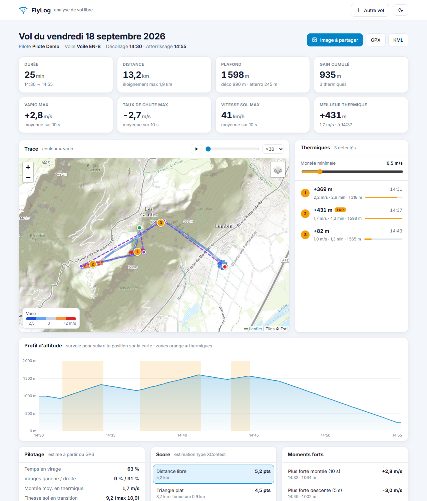
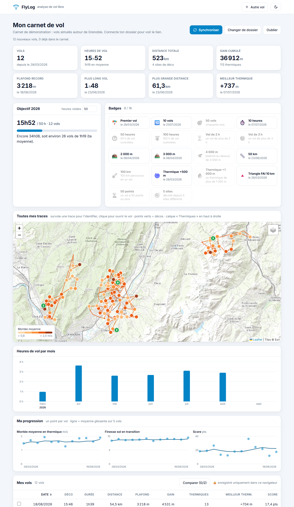

# 🪂 FlyLog

[](https://github.com/ElRelook/flylog/actions/workflows/tests.yml)


[](https://elrelook.github.io/flylog/)

*[English version](README.en.md)*

**Analyse de traces de vol libre (parapente, delta) au format IGC** : statistiques, thermiques, vent, score, espaces aériens, carnet de vol et incrustation vidéo.

👉 **[Essayer en ligne](https://elrelook.github.io/flylog/)** · [un vol d'exemple](https://elrelook.github.io/flylog/?demo=vol) · [un carnet de démo](https://elrelook.github.io/flylog/?demo=carnet)



## Fonctionnalités

**Analyse d'un vol**
- 📊 Statistiques : durée, distance, plafond, gain cumulé, vario, vitesse
- 🌀 Détection des thermiques (montée, durée, plafond), avec seuil réglable
- 🧭 Pilotage : temps en virage, virages à gauche ou à droite, finesse sol en transition, facteur de charge
- 💨 **Vent estimé** à partir de la dérive en thermique
- 🏆 **Score type XContest** : distance libre à 3 points, triangle plat, triangle FAI
- ⚠️ **Espaces aériens** : pénétrations détectées à partir d'un fichier OpenAir (données France de [planeur-net](https://github.com/planeur-net/airspace))
- ⚡ Moments forts : plus forte montée et plus forte descente, vitesse max, spirales
- ▶️ Rejeu animé du vol, export GPX et KML (Google Earth 3D), **image à partager**

**Carnet de vol**
- 📒 Synchronisation avec le dossier où **Syride** copie tes vols (ou n'importe quel dossier d'IGC)
- 🗺️ **Toutes tes traces sur une seule carte**, avec la **carte des thermiques** de tous tes vols
- 📈 Progression vol après vol, heures par mois, objectif annuel, 18 badges
- 🆚 **Comparaison de deux vols** rejoués côte à côte
- 📍 Noms des sites de déco (ParaglidingEarth)

**Incrustation vidéo** : une vidéo transparente (vario, altitude, vitesse, mini-carte, profil) à poser sur tes images GoPro ou Insta360, calée automatiquement sur l'heure de tournage.



## Interface web

L'interface **n'a pas de serveur** : le package Python `flylog` tourne directement dans le navigateur grâce à [Pyodide](https://pyodide.org). Les calculs sont donc les mêmes qu'en ligne de commande, et couverts par les tests. **Tes fichiers ne quittent jamais ton ordinateur**, et ton carnet reste enregistré dans ton navigateur.

- **Carnet Syride** : « Connecter mon dossier Syride », puis choisis `Documents\Syride`. Chrome et Edge se souviennent du dossier : ensuite, un clic sur *Synchroniser* suffit.
- **Application installable** : sur téléphone, « Ajouter à l'écran d'accueil ». Elle marche hors ligne, et sur Android elle apparaît dans le menu *Partager* des fichiers `.igc`.

Pour la lancer en local :

```bash
python -m http.server 8000
# puis ouvre http://localhost:8000
```

## Ligne de commande

```bash
pip install "flylog-igc[plot]"      # ou, depuis ce dépôt : pip install -e ".[plot]"
```

```bash
flylog vol.igc                                   # analyse complète dans le terminal
flylog vol.igc --map carte.html --profile profil.png --gpx vol.gpx --kml vol.kml
flylog vol.igc --airspace france.txt             # vérification des espaces aériens (OpenAir)

flylog sync                                      # carnet : ajoute les nouveaux vols de Documents/Syride
flylog carnet                                    # totaux, records, sites, liste des vols

flylog overlay vol.igc incrust.mov --video GX010123.MP4   # incrustation calée sur le clip
flylog overlay vol.igc incrust.mov --start 14:32 --duration 90
```

<details>
<summary>Exemple de sortie de <code>flylog vol.igc</code></summary>

```
  Vol du 12/07/2026
  Voile  : Flow Future

  Durée                 2h57
  Distance parcourue    103.2 km
  Altitude max          3319 m
  Gain cumulé           6914 m
  ...

  Pilotage
  Temps en virage       40 %  (dont 84 % à gauche)
  Montée moy. thermique 1.3 m/s
  Finesse sol en transition 8.6, max 14.3  à 37 km/h
  Vent moyen estimé     5 km/h du sud (167°)

  Score (estimation type XContest)
    Distance libre      42.2 km  →   42.2 pts
    Triangle plat        7.3 km  →    8.8 pts, fermeture 1.8 km

  Espaces aériens :
    ⚠ 10:44:43  LF-R196A1 EST GAP (NOTAM) [R, 1006 m sol → FL195]  (limite sol : à vérifier)
```
</details>

Le module s'utilise aussi depuis Python :

```python
from flylog import read_igc, compute_stats, detect_thermals
from flylog.metrics import piloting_metrics
from flylog.score import best_scores

vol = read_igc("mon_vol.igc")
print(compute_stats(vol).max_alt, piloting_metrics(vol).wind)
print(best_scores(vol)[0].points)
```

## Comment ça marche

| Calcul | Méthode |
|---|---|
| Distance | Formule de haversine entre chaque point GPS |
| Vario | Pente de l'altitude sur une fenêtre glissante (5 à 20 s) |
| Thermiques | Vario moyen > 0,5 m/s pendant au moins 30 s ; deux montées séparées de moins de 45 s sont fusionnées |
| Virages | Variation du cap « déroulé » : plus de 6°/s signifie en virage |
| Vent | Sur un nombre entier de tours en thermique, la vitesse propre s'annule : la dérive moyenne donne le vent |
| Facteur de charge | Virage coordonné : n = √(1 + (v·ω/g)²) |
| Score | Optimisation sur la trace rééchantillonnée : programmation dynamique pour la distance libre, recherche des triangles avec fermeture ≤ 20 % |
| Espaces aériens | Point dans polygone (cercles et arcs OpenAir convertis en polygones), limites FL comparées à l'altitude baro, AMSL comparées à l'altitude GPS |

Toutes ces valeurs sont **estimées à partir du GPS**, avec en général un point par seconde. Elles servent à comparer ses vols. Pour les espaces aériens, vérifie toujours les NOTAM et les cartes officielles.

## Développement

```bash
pip install -e ".[dev,plot]"
pytest --cov=flylog        # tests (93 % de couverture)
ruff check . && mypy       # style et types, aussi vérifiés par la CI
python scripts/generate_example.py --demo   # régénère les vols de démo (simulés)
python scripts/screenshots.py               # régénère les captures du README
```

Les vols de `examples/` sont **simulés** par [`scripts/generate_example.py`](scripts/generate_example.py). Aucune vraie trace n'est versionnée.

## Feuille de route

- [ ] Replay 3D sur le relief
- [ ] Classement des sites par saison et par orientation du vent
- [ ] Import direct depuis Syride si une API officielle voit le jour

Voir le [CHANGELOG](CHANGELOG.md).

## Licence

MIT
